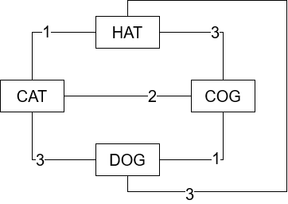

# Fallout Terminal Solver

Reactive web app for helping solve terminal puzzles in the Fallout games.

## Problem

Given a set of words of the same length, find the one solution word within a limited number of guesses. If the wrong word is selected, the number of characters matching the solution is returned. The matching characters are not returned - only the number of correct characters.

## Solution

### UI

Web app written in ReactJS to let the user enter the set of words served in the puzzle.

A tutorial appears at the top to guide them to entering valid inputs (same length, non-empty).

To allow them to enter words more quickly, there are custom keyboard events for deleting words (backspace on empty), adding a new word (enter), and moving up and down (arrow keys).

There is a number input to set the number of matching characters that the puzzle has returned for that word.

### Solver algorithm

When a valid state of words and matches exists, a `Solve` function will be ran to eliminate words that cannot possible be the solution.

We build an undirected fully connected graph for the set of words, where a node exists for each node and the distance between each node is the number of differing characters.

We then compare the words that we haven't checked to the words that we have checked. If we have the number of matching characters between these two words matches the number of matching characters between the checked word and solution, then it is a possible solution.

The solutions that aren't possible will be set as inactive to the user.

## Fancy features

- Functional React components
- State and Effect hooks
- Contexts for propagating themes down the tree
- Keyboard event overriding for better UX
- Removed impossible solutions reactively

## Example GIF

